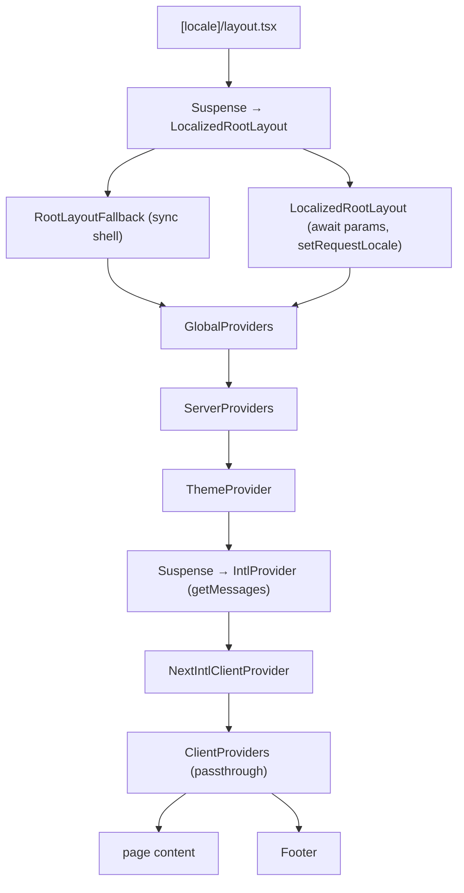

# Partial Prerendering (PPR) - `apps/codehouse`

Partial Prerendering with `cacheComponents` in Next.js 16. Covers the codehouse-specific integration with `next-intl`, provider hierarchy, and route layout patterns.

**Scope:** `apps/codehouse` only. `apps/main` also enables `cacheComponents` but uses a different layout/i18n setup - see [themes.md](themes.md) for shared provider conventions.

Docs: [Next.js Cache Components](https://nextjs.org/docs/app/api-reference/config/next-config-js/cacheComponents) · [Next.js `'use cache'`](https://nextjs.org/docs/app/api-reference/directives/use-cache) · [next-intl static rendering](https://next-intl.dev/docs/routing/setup#static-rendering)

## Why codehouse uses PPR

Codehouse has a **request-dependent shell** (locale from `[locale]`, theme script, i18n messages) and **mostly static page content** (marketing sections, translations keyed by locale).

Without PPR, awaiting `params` or `getMessages()` in the root layout forces the entire page dynamic. With `cacheComponents: true`:

- The **shell streams** at request time (locale, env script, intl provider).
- **Page bodies** prerender behind `'use cache'` and revalidate on a schedule (`cacheLife('hours')`).

This matches Next.js 16's recommended model: dynamic boundaries behind `Suspense`, static work in Cache Components.

## Enable PPR

```ts
// apps/codehouse/next.config.ts
const nextConfig: NextConfig = {
  cacheComponents: true,
  // ...
};
```

Required for `'use cache'`, `cacheLife`, and `cacheTag`. Replaces the deprecated `experimental.ppr` flag.

## Architecture

### Provider + layout tree



### Route segment layout (all marketing routes)

Each route group layout follows the same pattern:

```
(root|consumer|freelance|commercial)/layout.tsx
├── Header          ← sync Server Component (static in shell)
└── CachedPageContent (use cache)
    └── {children}  ← page + sections
```

ASCII equivalent:

```
[locale]/layout.tsx
└── Suspense → LocalizedRootLayout
    └── GlobalProviders
        ├── ServerProviders (ThemeProvider → Suspense → getMessages)
        ├── ClientProviders
        ├── (root|consumer|freelance|commercial)/layout.tsx
        │   ├── Header
        │   └── CachedPageContent ('use cache')
        │       └── page.tsx
        └── Footer
```

| Layer | File | Dynamic? | Why |
| ----- | ---- | -------- | --- |
| Root shell | `[locale]/layout.tsx` | Yes (streamed) | `await params` for `lang={locale}` |
| Env bootstrap | `EnvScript` in `<head>` | Yes (streamed) | Reads runtime env at request time |
| Intl messages | `server.server-providers.tsx` | Yes (streamed) | `getMessages()` |
| Route header | `*/layout.tsx` → `Header` | No | Sync RSC; no `await` |
| Page body | `CachedPageContent` | Cached | `'use cache'` + `cacheLife('hours')` |
| Footer | `footer.tsx` | Mixed | Server translations; client copyright year |

## Where Suspense is required vs not

With `cacheComponents`, any Server Component that **awaits request-time data** must be behind a `Suspense` boundary (or use `'use cache'` / request APIs correctly). Blocking the root without `Suspense` **fails the build**.

| Location | Suspense? | Reason |
| -------- | --------- | ------ |
| `LocalizedRootLayout` (`await params`) | **Yes** - outer boundary in `RootLayout` | Params are request-time; must not block static shell |
| `EnvScript` | **Yes** - in `<head>` | Runtime env injection |
| `IntlProvider` / `getMessages()` | **Yes** - in `ServerProviders` | Loads locale messages at request time |
| `Header` in route layouts | **No** | Sync component; no uncached awaits |
| `Footer` | **No** | Async server component; `getTranslations` is static per locale when `setRequestLocale` ran |
| `Address` in footer | **No** | Same - server `getTranslations`, not a separate dynamic hole |
| `CachedPageContent` | **No** | Uses `'use cache'` instead of Suspense |
| Route layout `await params` | **No** (today) | Only reads locale to pass into cache key; does not block root because root already resolved params in parallel segment |

**Do not** wrap static components in Suspense just to change build symbols. Only add boundaries where Next.js requires them for uncached async work.

## `CachedPageContent` pattern

Shared wrapper for all route-level page bodies:

```tsx
// apps/codehouse/src/app/[locale]/_ppr/cached-page-content.tsx
export async function CachedPageContent({ children, locale }: CachedPageContentProps) {
  'use cache';
  cacheLife('hours');
  cacheTag(`page-${locale}`);

  return children;
}
```

| API | Role |
| --- | ---- |
| `'use cache'` | Marks the subtree as a Cache Component - eligible for build-time prerender + incremental revalidation |
| `cacheLife('hours')` | Revalidate profile (1h revalidate, 1d expire in build output) |
| `cacheTag(\`page-${locale}\`)` | Tag for on-demand invalidation via `revalidateTag('page-en')` etc. |

Route layouts pass `locale` from `await params` so each locale gets its own cache entry:

```tsx
// Pattern in (root|consumer|freelance|commercial)/layout.tsx
export default async function RouteLayout({ children, params }) {
  const { locale } = (await params) as { locale: LocaleCode };

  return (
    <>
      <Header />
      <CachedPageContent locale={locale}>{children}</CachedPageContent>
    </>
  );
}
```

Invalidate a locale's cached pages after content changes:

```ts
import { revalidateTag } from 'next/cache';

revalidateTag('page-en');
```

## next-intl integration

### `setRequestLocale` - layout **and** pages

Per [next-intl static rendering docs](https://next-intl.dev/docs/routing/setup#static-rendering), call `setRequestLocale(locale)` in **every layout and page** that should render statically. Layouts and pages can be rendered independently - layout-only is not enough.

| File | Calls `setRequestLocale`? |
| ---- | ------------------------- |
| `[locale]/layout.tsx` → `LocalizedRootLayout` | Yes |
| `(root)/page.tsx` | Yes |
| `(routes)/consumer/page.tsx` | Yes |
| `(routes)/freelance/page.tsx` | Yes (`use(params)` + client `useTranslations`) |
| `(routes)/commercial/page.tsx` | No (placeholder page, no i18n yet) |
| `[...rest]/page.tsx` | Yes (before `notFound()`) |

When adding a new localized page, always add `setRequestLocale` even if the root layout already sets it.

### `hasLocale` + `notFound` validation

Invalid locale segments must 404, not silently fall through:

```tsx
// [locale]/layout.tsx → LocalizedRootLayout
if (!hasLocale(routing.locales, locale)) {
  notFound();
}
setRequestLocale(locale);
```

`request.ts` resolves unknown locales to `routing.defaultLocale` for middleware-level requests, but the **layout is the gate** for direct URL access to `/xx/...`.

### `request.ts` - locale resolution

```tsx
// apps/codehouse/src/i18n/request.ts
export default getRequestConfig(async ({ requestLocale }) => {
  const requested = await requestLocale;
  const resolvedLocale = hasLocale(routing.locales, requested) ? requested : routing.defaultLocale;

  return {
    locale: resolvedLocale,
    messages: (await import(`../../messages/${resolvedLocale}.json`)).default,
  };
});
```

Do **not** call `notFound()` here - that belongs in the layout. `request.ts` only picks a fallback locale for intl config.

## `RootLayoutFallback` and `routing.defaultLocale`

During PPR, the sync shell renders before `LocalizedRootLayout` resolves `params`. The fallback must still emit valid HTML:

```tsx
function RootLayoutFallback({ children }: { children: ReactNode }) {
  return (
    <html lang={routing.defaultLocale} suppressHydrationWarning /* ... */>
      {/* EnvScript in Suspense, GlobalProviders, children, Footer */}
    </html>
  );
}
```

### Why not `suppressHydrationWarning` for locale?

| Mechanism | Purpose |
| --------- | ------- |
| `suppressHydrationWarning` on `<html>` | Tells React to ignore **client/server attribute mismatches** during hydration (theme class, etc.) |
| `setRequestLocale` | Enables **static rendering** of server translations for a given locale |
| `routing.defaultLocale` in fallback | Best-effort `lang` until the streamed layout replaces it |

`suppressHydrationWarning` does **not**:

- Satisfy `cacheComponents` rules for `new Date()` or other dynamic APIs
- Replace `setRequestLocale`
- Fix incorrect `lang` during the PPR shell - use `routing.defaultLocale`, not a hardcoded string

For `/nl` routes, the shell may briefly show `lang={defaultLocale}` until `LocalizedRootLayout` streams. That is inherent to dynamic `[locale]` params under PPR unless you adopt `next/root-params` (see below).

## Build output symbols

After `pnpm build` in `apps/codehouse`:

```
○  (Static)             prerendered as static content
◐  (Partial Prerender)  prerendered as static HTML with dynamic server-streamed content
ƒ  (Dynamic)            server-rendered on demand
```

Example output (current `feature/ppr`):

| Route | CLI symbol | Manifest `renderingMode` | Revalidate |
| ----- | ---------- | ------------------------ | ---------- |
| `/[locale]` (root) | ƒ | `PARTIALLY_STATIC` | 1h |
| `/[locale]/consumer` | ƒ | `PARTIALLY_STATIC` | 1h |
| `/[locale]/freelance` | ƒ | `PARTIALLY_STATIC` | 1h |
| `/[locale]/commercial` | ƒ | `PARTIALLY_STATIC` | 1h |
| `/[locale]/[...rest]` | ◐ | `PARTIALLY_STATIC` | - |

**Key insight:** CLI symbol and manifest mode can disagree. **`ƒ` does not mean PPR is broken.** It means Next.js did not emit a prerendered `.html` shell artifact for that route at build time. The manifest still records `PARTIALLY_STATIC` + `experimentalPPR: true` + cache revalidation - PPR is active.

Commercial shows `ƒ` because its page tree is minimal static RSC (`<h1>Business Solutions</h1>`) with no client streaming holes - not because of a misconfiguration. **Do not add fake Suspense or client components just to get `◐`.**

Adding page-level `setRequestLocale` (which `await params` / `use(params)`) can shift routes from `◐` to `ƒ` while keeping `PARTIALLY_STATIC` in the manifest. That trade-off is acceptable for correct next-intl static rendering.

Inspect details in `.next/prerender-manifest.json` after build.

## Footer copyright - client vs server dynamic

`cacheComponents` rejects `new Date()` in Server Components unless request-time context is established first (`connection()`, `cookies()`, etc.).

| Approach | When to use |
| -------- | ----------- |
| **Client `CopyrightMessage`** (current) | Year computed in browser via `new Date().getFullYear()` - no build error, no Suspense, no `connection()` |
| **Server `await connection()` then `new Date()`** | Keep copyright in RSC; adds a dynamic hole - only if you need server-rendered year |
| **`suppressHydrationWarning`** | Hydration mismatch only - **does not** fix `cacheComponents` dynamic API errors |

Current implementation:

```tsx
// copyright-message.tsx - 'use client'
export function CopyrightMessage() {
  const t = useTranslations('Footer');
  const date = new Date().getFullYear();
  return t('Copyright_message', { date });
}
```

`Footer` itself stays an async Server Component. `Address` uses `getTranslations('Footer')` at the server level - no Suspense needed when `setRequestLocale` ran in the layout.

## Future migration: `next/root-params`

When Next.js exposes stable root-param propagation, next-intl recommends wiring locale through `request.ts` via `next/root-params` instead of awaiting `params` in the root layout. This would:

- Remove the need for `RootLayoutFallback` with a provisional `lang`
- Let the PPR shell know the locale without a dynamic `params` await in the layout

Track: [next-intl issue #1493](https://github.com/amannn/next-intl/issues/1493).

Not implemented yet - requires a larger migration across layout, `request.ts`, and possibly middleware.

## Monorepo touchpoints

| File | Responsibility |
| ---- | -------------- |
| `apps/codehouse/next.config.ts` | `cacheComponents: true` |
| `apps/codehouse/src/app/[locale]/layout.tsx` | PPR shell split, `hasLocale`, `setRequestLocale`, `generateStaticParams` |
| `apps/codehouse/src/providers/server.global-providers.tsx` | Composes server → client providers |
| `apps/codehouse/src/providers/server.server-providers.tsx` | `ThemeProvider` + Suspense-wrapped `getMessages` |
| `apps/codehouse/src/providers/client.client-providers.tsx` | Client provider slot (empty passthrough) |
| `apps/codehouse/src/app/[locale]/_ppr/cached-page-content.tsx` | Shared `'use cache'` wrapper |
| `apps/codehouse/src/app/[locale]/(root)/layout.tsx` | Header + `CachedPageContent` |
| `apps/codehouse/src/app/[locale]/(routes)/consumer/layout.tsx` | Same pattern |
| `apps/codehouse/src/app/[locale]/(routes)/freelance/layout.tsx` | Same pattern |
| `apps/codehouse/src/app/[locale]/(routes)/commercial/layout.tsx` | Same pattern |
| `apps/codehouse/src/app/[locale]/(components)/footer.tsx` | Server footer; delegates copyright to client |
| `apps/codehouse/src/app/[locale]/(components)/copyright-message.tsx` | Client-only dynamic year |
| `apps/codehouse/src/i18n/request.ts` | `getRequestConfig`, locale fallback |
| `apps/codehouse/src/i18n/routing.ts` | `locales`, `defaultLocale` |
| `packages/ui/src/components/theme-provider.tsx` | Theme provider compatible with `cacheComponents` - see [themes.md](themes.md) |

For general i18n key naming and locale sync, see the [translations skill](../translations/SKILL.md).

## Adding a new route - do's and don'ts

### Do

1. Create a route layout with **static `Header` + `CachedPageContent`** (copy an existing route layout).
2. Call **`setRequestLocale(locale)`** in the page (and in the layout if it reads translations).
3. Validate locale in the **root layout** with `hasLocale` + `notFound()` - do not duplicate in every route.
4. Keep **`generateStaticParams`** returning all locales in `[locale]/layout.tsx`.
5. Use **`getTranslations`** in Server Components; **`useTranslations`** only in Client Components.
6. Put **dynamic APIs** (`cookies`, `headers`, `connection`, `new Date` in RSC) behind Suspense or move them to client components.
7. Run **`pnpm build`** in `apps/codehouse` and confirm the route shows revalidate time and `PARTIALLY_STATIC` in the manifest.

### Don't

1. **Don't** remove `cacheComponents` or `'use cache'` to "fix" a `ƒ` symbol when the manifest already says `PARTIALLY_STATIC`.
2. **Don't** call `setRequestLocale` only in the root layout - pages need it too.
3. **Don't** use `suppressHydrationWarning` instead of proper dynamic-boundary handling.
4. **Don't** use `new Date()` in Server Components without `connection()` or a client wrapper.
5. **Don't** block the root layout with uncached `await` outside Suspense.
6. **Don't** add Suspense around static `Header` or server `getTranslations` sections "just in case".
7. **Don't** import `@wrksz/themes/next` or mount `ThemeProvider` in `layout.tsx` - use `server.server-providers.tsx` per [themes.md](themes.md).

## Related docs

- [themes.md](themes.md) - `@wrksz/themes` provider hierarchy (shared with codehouse PPR setup)
- [translations skill](../translations/SKILL.md) - message keys, locale files
- [Next.js i18n guide](https://nextjs.org/docs/app/guides/internationalization)
- [next-intl App Router setup](https://next-intl.dev/docs/routing/setup)
